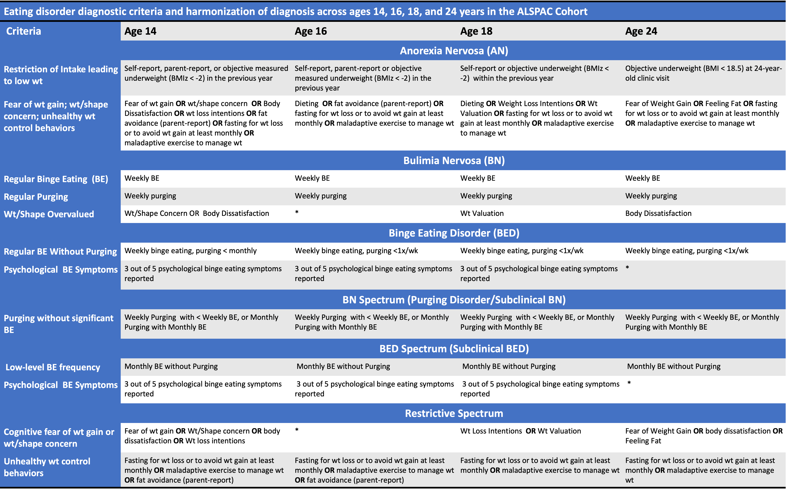

# Eating Disorder Diagnoses

Eating disorder diagnoses (AN, BN,BED, BN-Spectrum [Purging disorder and subclinical BN], BED-spectrum [subclinical BED], and Restrictive spectrum [ED cognitions and restrictive ED behaviors in the absence of regular binge eating, purging, or low weight]) were derived at each age (14, 16, 18, and 24) using best available measures and following steps outlined in @micaliAdolescentEatingDisorders2015, with minor changes (cognitive measures added to criteria as available; subclinical and OSFED categories collapsed to reflect BN, BED, and Restrictive Spectrum ED pathology). Scoring algorithms reflect DSM-5 criteria aligned as well as possible with available data that can be harmonized across assessment points [@americanpsychiatricassociationDiagnosticStatisticalManual2013]. While the majority of cognitive and and behavioral ED features are self-reported, parent-report of restrictive eating was included as an indicator at ages 14 and 16 years as adolescents tend to under-report AN symptoms [@houseDiagnosingEatingDisorders2008]. Table \@ref(fig:alspac-dx-table) outlines full criteria used for each diagnosis in the current project.

```{r alspac-dx-table, fig.cap= 'Diagnostic Criteria Assessed Across Age', out.width = '160%', echo = FALSE}

```

***Note***. \* indicates that criteria was not assessed at that timepoint. Criteria thus not required for diagnosis at relevant timepoint. Wt = Weight. AN criteria 'Fear of Gaining Weight' and 'Disturbance in body weight/shape, self-worth influenced by weight and shape, or persistent lack of recognition of seriousness of low body weight' combined as a single indicator due to inconsistent measurement in fear of weight gain and potential for lack of insight amongst youth. At each timepoint, diagnosis was given hierarchically from top to bottom of the table (e.g. if symptoms meeting criteria for AN and BN are both endorsed, AN is the given diagnosis).
